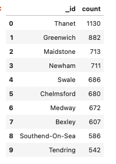

# nosql-challenge

The UK Food Standards Agency evaluates various establishments across the United Kingdom, and gives them a food hygiene rating. For food magazine, Eat Safe, Love, I evaluated some of the ratings data in order to help their journalists and food critics decide where to focus future articles.

## Deliverable 1: A Jupyter notebook containing code that imports the data and sets up and updates the uk_food database.

The `NoSQL_setup.ipynb` sets up and updates the database. The data provided in the `establishments.json` file was imported using Terminal with `mongoimport --type json -d uk_food -c establishments --drop --jsonArray establishments.json`.

* Insert the new halal restaurant opened in Greenwich to the Database.
  
`if establishments.find_one({"BusinessName":halal_rest["BusinessName"]}) == None:
    # Insert the new data into the collection
    establishments.insert_one(halal_rest)
    
    # Print objectID when inserted
    print(f'Adding restaurant with Business Name: {halal_rest["BusinessName"]}')`

* Update the new restauarant with the correct BusineesTypeID.
  
`establishments.update_one({"BusinessName":halal_rest["BusinessName"]},  {'$set': {'BusinessTypeID': 1}})`

* Drop all establishments that has Dover as their Local Authority from the database.
  
`query = {'LocalAuthorityName': 'Dover'}
result = establishments.delete_many(query)`

* Convert latitude and longitude to decimal numbers.

`establishments.update_many({}, [ {'$set': { "geocode.latitude" : {'$toDouble': "$geocode.latitude"},
                                                "geocode.longitude" : {'$toDouble': "$geocode.longitude"}
                                              }
                                     } ]
                              )`

 * First set the non 1-5 Rating Values to Null and then Convert the data type from String to Integer for RatingValue.   
 
 `non_ratings = ["AwaitingInspection", "Awaiting Inspection", "AwaitingPublication", "Pass", "Exempt"]
establishments.update_many({"RatingValue": {"$in": non_ratings}}, [ {'$set':{ "RatingValue" : None}} ])

establishments.update_many({}, [ {'$set': { "RatingValue" : {'$toInt': "$RatingValue"}
                                              }
                                     } ]
                              )`

* Check that the coordinates and rating value are now numbers.

`query = {
    "$expr": {
        "$and": [
            { "$eq": [{ "$type": "$geocode.latitude" }, "double"] },
            { "$eq": [{ "$type": "$geocode.longitude" }, "double"] },
            { "$eq": [{ "$type": "$RatingValue" }, "int"] }  
        ]
    }
}
results = list(establishments.find(query))

if len(results) > 0:
    print("All checked fields are stored as numbers.")
else:
    print("Some fields are not stored as numbers.")`

## Deliverable 2: A Jupyter notebook containing code that performs the exploratory analysis queries in the database.

Eat Safe, Love has specific questions they want you to answer, which will help them find the locations they wish to visit and avoid. The `NoSQL_analysis.ipynb` queries relevant information for analyses and converts results into Pandas DataFrame.

1. Which establishments have a hygiene score equal to 20?

   There are 41 establishments with a hygiene score of 20 from the uk_food dataset. 

2. Which establishments in London have a `RatingValue` greater than or equal to 4?                                       

   There are 33 establishments in London that have a RatingValue greater than or equal to 4 from the uk_food dataset.

3. What are the top 5 establishments with a RatingValue of 5, sorted by lowest hygiene score, nearest to the new restaurant added, "Penang Flavours"?                                                                                 

   The top 5 establishments with a RatingValue of '5' sorted by lowest hygiene score nearest to "Penang Flavours" are: "Mobile caterer", "Lumbini Grocery Ltd T/A Al-Iman", "Atlantic Fish Bar", "Iceland" and "Volunteer.            

4. How many establishments in each Local Authority area have a hygiene score of 0? Sort the results from highest to lowest, and print out the top ten local authority areas.

   There are 55 rows in the DataFrame. This is the preview of the first 10 rows:                                                                                                                                                              
   
